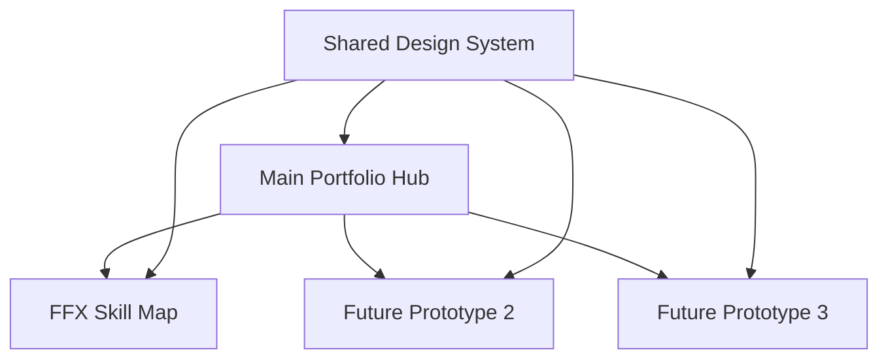

# Workspace Architecture: Multi-SPA Portfolio with Shared Design System

## Overview

This project demonstrates a **monorepo workspace architecture** using Yarn workspaces to manage multiple Single Page Applications (SPAs) with a shared design foundation. The main portfolio serves as a showcase hub while individual prototypes function as independent SPAs with inherited design tokens and selective customization.

## Table of Contents

- [Workspace Concept](#workspace-concept)
- [Multi-SPA Architecture](#multi-spa-architecture)
- [Industry Best Practices](#industry-best-practices)
- [Design Token Inheritance](#design-token-inheritance)
- [Prototype Identity Customization](#prototype-identity-customization)
- [Implementation Guide](#implementation-guide)
- [Current Architecture Analysis](#current-architecture-analysis)

## Workspace Concept

### What are Yarn Workspaces?

Yarn workspaces enable **monorepo management** where multiple related packages share dependencies and can reference each other. In our portfolio context:

```json
{
  "workspaces": [
    "prototypes/ffx-skill-map",
    "prototypes/future-prototype-*"
  ]
}
```

### Benefits for Portfolio Architecture

1. **Dependency Deduplication**: Shared libraries (React, TypeScript, Tailwind) are installed once
2. **Cross-Package References**: Prototypes can import from shared design system
3. **Unified Build Pipeline**: Single command builds all SPAs
4. **Consistent Tooling**: Shared ESLint, TypeScript, and build configurations

### Current Structure

```
proto-portal-showcase-hub/
├── package.json                 # Root workspace configuration
├── src/                        # Main portfolio SPA
├── prototypes/
│   └── ffx-skill-map/          # Workspace: @proto-portal/ffx-skill-map
└── shared/design-tokens        # Workspace: @proto-portal/design-tokens
```

## Multi-SPA Architecture

### Architecture Pattern: Hub and Spokes



### Deployment Strategy

Each SPA builds independently but deploys as a unified site:

```bash
# Build pipeline
yarn build                           # Main portfolio → dist/
yarn workspace @proto-portal/ffx-skill-map build  # Prototype → prototypes/ffx-skill-map/dist/

# Deployment structure
dist/
├── index.html                      # Main portfolio
├── assets/                         # Main portfolio assets
└── prototypes/
    ├── ffx-skill-map/              # FFX prototype SPA
    │   ├── index.html
    │   └── assets/
    └── future-prototype/           # Future prototypes
```

### Routing Architecture

- **Main Portfolio**: `https://example.com/` - React Router for internal navigation
- **FFX Prototype**: `https://example.com/prototypes/ffx-skill-map/` - Independent React Router
- **Future Prototypes**: `https://example.com/prototypes/{name}/` - Isolated routing contexts

## Industry Best Practices

### ✅ When Multi-SPA Workspaces Are Ideal

**Portfolio/Showcase Applications** (Our Use Case):
- Independent prototypes with different domains
- Shared design foundation but unique identities
- Gradual migration and experimentation
- Different technical requirements per prototype

**Enterprise Applications**:
- Micro-frontend architecture
- Team boundaries align with workspace boundaries
- Independent deployment cycles needed

### ⚠️ When to Consider Alternatives

**Single Unified Application**:
- Tight integration between features
- Shared state management across "prototypes"
- Consistent user experience throughout

**Separate Repositories**:
- Completely independent products
- Different teams with no shared infrastructure
- Distinct deployment and maintenance cycles

### Our Architecture Assessment

**Why Multi-SPA Works Here**:
1. **Domain Separation**: FFX skill mapping vs. portfolio showcase
2. **Technical Experimentation**: Different data visualization libraries
3. **Independent Evolution**: Prototypes can have different lifecycles
4. **Showcase Value**: Demonstrates architectural thinking to potential employers

## Design Token Inheritance

### Current Token Architecture

#### Foundation Layer (CSS Custom Properties)

```css
/* Main Portfolio: src/index.css */
:root {
  /* Brand Colors */
  --primary: 263 70% 60%;           /* Purple brand */
  --primary-foreground: 0 0% 98%;
  
  /* Semantic Colors */
  --background: 240 10% 3.9%;      /* Dark theme */
  --foreground: 0 0% 98%;
  --secondary: 240 3.7% 15.9%;
  
  /* Custom Design Tokens */
  --gradient-primary: linear-gradient(135deg, hsl(263, 70%, 60%), hsl(280, 100%, 70%));
  --shadow-glow: 0 0 40px hsl(263, 70%, 60% / 0.3);
  --transition-smooth: all 0.3s cubic-bezier(0.4, 0, 0.2, 1);
}
```

#### Tailwind Integration Layer

```typescript
// tailwind.config.ts
export default {
  theme: {
    extend: {
      colors: {
        primary: "hsl(var(--primary))",
        "primary-foreground": "hsl(var(--primary-foreground))",
        background: "hsl(var(--background))",
        foreground: "hsl(var(--foreground))",
      },
      backgroundImage: {
        'gradient-primary': 'var(--gradient-primary)',
      },
      boxShadow: {
        'glow': 'var(--shadow-glow)',
      }
    }
  }
}
```

### Inheritance Patterns

#### Pattern 1: Token Inheritance (Current)

```css
/* FFX Prototype: prototypes/ffx-skill-map/src/index.css */
/* Inherits base tokens (lines 1-84) */
@import "../../src/index.css"; /* Conceptual - currently duplicated */

/* Extends with domain-specific tokens */
:root {
  /* FFX Game-Specific Colors */
  --ffx-combat: 220 100% 65%;     /* Blue for combat skills */
  --ffx-magic: 280 100% 70%;      /* Purple for magic skills */
  --ffx-support: 160 100% 50%;    /* Green for support skills */
  
  /* FFX Interaction States */
  --skill-locked: 0 0% 40%;
  --skill-available: 48 100% 67%;
  --skill-learned: 142 76% 47%;
}
```

#### Pattern 2: Component Inheritance (Future)

```tsx
// Shared Design System Component
// @proto-portal/design-tokens (tokens only; components are app-local)
export const Button = ({ variant = "primary", ...props }) => (
  <button className={cn(
    "px-4 py-2 rounded-md font-medium transition-smooth",
    "bg-primary text-primary-foreground hover:shadow-glow",
    variants[variant]
  )} {...props} />
);

// FFX Prototype Override
// prototypes/ffx-skill-map/src/components/SkillButton.tsx
import { baseTailwindConfig } from "@proto-portal/design-tokens";

export const SkillButton = ({ skillType, ...props }) => (
  <Button 
    className={cn(
      "relative border-2",
      skillType === "combat" && "border-ffx-combat bg-ffx-combat/10",
      skillType === "magic" && "border-ffx-magic bg-ffx-magic/10"
    )}
    {...props} 
  />
);
```

## Prototype Identity Customization

### Customization Strategies

#### 1. Additive Styling (Recommended)

**Base Foundation** + **Domain Extensions**:

```css
/* Inherit all base tokens */
/* Add domain-specific extensions */
:root {
  /* Keep: --primary, --background, etc. */
  
  /* Add: Domain-specific tokens */
  --game-health: 0 100% 50%;
  --game-mana: 240 100% 60%;
  --game-experience: 45 100% 60%;
}
```

**Benefits**:
- Maintains brand consistency
- Easy to maintain and update
- Clear inheritance hierarchy

#### 2. Selective Override (For Strong Identity)

```css
:root {
  /* Override brand color for strong prototype identity */
  --primary: 200 100% 50%;        /* Cyan for tech demo */
  --gradient-primary: linear-gradient(135deg, hsl(200, 100%, 50%), hsl(220, 100%, 60%));
  
  /* Keep: Layout, typography, and semantic tokens */
  /* Add: Prototype-specific tokens */
}
```

#### 3. Component Variant System

```tsx
// Design System Button with variant support
const Button = ({ variant, prototype, ...props }) => (
  <button className={cn(
    baseStyles,
    variant === "primary" && "bg-primary",
    prototype === "ffx" && "font-game border-2",
    prototype === "tech" && "font-mono uppercase tracking-wide"
  )} />
);
```

### Identity Customization Examples

#### FFX Skill Map Identity

**Visual Language**: Game-inspired, mystical, node-based
```css
:root {
  /* Skill Type Colors */
  --skill-combat: 220 100% 65%;    /* Blue - water/ice magic */
  --skill-magic: 280 100% 70%;     /* Purple - black magic */
  --skill-support: 160 100% 50%;   /* Green - healing/support */
  
  /* Game UI Elements */
  --node-border: 2px solid hsl(var(--skill-type));
  --connection-line: 1px dashed hsl(var(--foreground) / 0.3);
  --glow-active: 0 0 20px hsl(var(--skill-type) / 0.8);
}
```

**Typography**: Game-inspired font choices
```css
.skill-node {
  font-family: 'Orbitron', monospace; /* Futuristic feel */
  text-transform: uppercase;
  letter-spacing: 0.1em;
}
```

#### Future Tech Demo Identity

**Visual Language**: Clean, modern, data-focused
```css
:root {
  /* Override primary for tech theme */
  --primary: 200 100% 50%;         /* Cyan */
  --accent: 120 100% 50%;          /* Electric green */
  
  /* Tech-specific tokens */
  --data-visualization: linear-gradient(90deg, hsl(200, 100%, 50%), hsl(280, 100%, 50%));
  --grid-pattern: 1px solid hsl(var(--foreground) / 0.1);
}
```

## Implementation Guide

### Setting Up New Prototype Workspace

#### 1. Add Workspace to Root Package.json

```json
{
  "workspaces": [
    "prototypes/ffx-skill-map",
    "prototypes/new-prototype"
  ]
}
```

#### 2. Create Prototype Package

```bash
mkdir prototypes/new-prototype
cd prototypes/new-prototype
```

```json
{
  "name": "@proto-portal/new-prototype",
  "version": "1.0.0",
  "private": true,
  "dependencies": {
    "@proto-portal/design-tokens": "workspace:*",
    "react": "^18.3.1",
    "react-dom": "^18.3.1"
  }
}
```

#### 3. Inherit Design Tokens

```css
/* prototypes/new-prototype/src/index.css */

/* Import base design system */
@import "@proto-portal/design-tokens/css/tokens.css";

/* Extend with prototype-specific tokens */
:root {
  /* Prototype identity customizations */
  --prototype-primary: 150 100% 50%;
  --prototype-accent: 45 100% 60%;
  
  /* Domain-specific tokens */
  --chart-color-1: hsl(var(--prototype-primary));
  --chart-color-2: hsl(var(--prototype-accent));
}
```

#### 4. Update Build Pipeline

```bash
# scripts/build.sh
yarn workspace @proto-portal/new-prototype build
cp -r prototypes/new-prototype/dist/* dist/prototypes/new-prototype/
```

### Design System Package Setup (Future)

#### 1. Create Shared Design System

```bash
mkdir shared/design-system
```

```json
{
  "name": "@proto-portal/design-system",
  "version": "1.0.0",
  "main": "dist/index.js",
  "types": "dist/index.d.ts",
  "exports": {
    ".": "./dist/index.js",
    "./tokens.css": "./dist/tokens.css",
    "./components/*": "./dist/components/*"
  }
}
```

#### 2. Token Export System

```typescript
// shared/design-system/src/tokens.ts
export const designTokens = {
  colors: {
    primary: "hsl(263, 70%, 60%)",
    background: "hsl(240, 10%, 3.9%)",
    foreground: "hsl(0, 0%, 98%)",
  },
  gradients: {
    primary: "linear-gradient(135deg, hsl(263, 70%, 60%), hsl(280, 100%, 70%))",
  },
  shadows: {
    glow: "0 0 40px hsl(263, 70%, 60% / 0.3)",
  }
} as const;

export type DesignTokens = typeof designTokens;
```

#### 3. Component Export System

```typescript
// shared/design-system/src/index.ts
export { Button } from "./components/Button";
export { Card } from "./components/Card";
export { designTokens } from "./tokens";
export type { DesignTokens } from "./tokens";
```

## Current Architecture Analysis

### Current State vs. Ideal Architecture

#### ✅ What's Working Well

1. **Consistent Token Foundation**: Both main and FFX use identical base design tokens
2. **Workspace Structure**: FFX prototype properly configured as Yarn workspace
3. **Build Pipeline**: Unified build process that combines all SPAs
4. **Domain Separation**: Clear separation between portfolio and prototype concerns

#### ⚠️ Current Limitations

1. **Component Duplication**: UI components are app-local rather than shared (by design), but some duplication exists
2. **Docs Drift**: Older references to `@proto-portal/design-system` components remain in some docs; current shared package is `@proto-portal/design-tokens`
3. **Token Adoption**: Ensure all apps consistently import tokens via `@proto-portal/design-tokens`

#### 🚀 Migration Path to Ideal Architecture

**Phase 1: Create True Design System Package**
```bash
# Create shared design system workspace
mkdir shared/design-system
# Move shared components and tokens
# Update workspace references
```

**Phase 2: Migrate components to consume shared tokens**
```typescript
// Replace hardcoded styles with token-based classes
// e.g., use bg-primary, text-foreground, utilities from shared tokens
```

**Phase 3: Token Import System**
```css
/* Replace duplicated tokens with imports */
@import "@proto-portal/design-tokens/css/tokens.css";
```

### Performance Considerations

#### Bundle Size Optimization

**Current**: Each prototype bundles its own React + dependencies
**Optimized**: 
- Shared dependencies via workspace hoisting
- Dynamic imports for prototype-specific features
- Build-time code splitting

```typescript
// Lazy load prototypes in main portfolio
const FFXSkillMap = lazy(() => import("@proto-portal/ffx-skill-map"));
```

#### Deployment Optimization

**Current**: All prototypes build and deploy together
**Optimized**: 
- Incremental builds (only changed prototypes)
- CDN-friendly asset structure
- Shared asset optimization

## Best Practices Summary

### ✅ Do This

1. **Inherit Base Tokens**: Always start with shared foundation
2. **Additive Customization**: Add domain-specific tokens rather than replacing
3. **Semantic Naming**: Use domain-appropriate token names (`--skill-combat` not `--blue-1`)
4. **Version Consistency**: Keep shared dependencies aligned across workspaces
5. **Build Integration**: Include all workspaces in unified build pipeline

### ❌ Avoid This

1. **Complete Token Override**: Don't replace fundamental brand tokens
2. **Component Duplication**: Don't copy-paste shared components
3. **Workspace Sprawl**: Don't create workspaces for every small feature
4. **Dependency Conflicts**: Don't use different versions of core dependencies
5. **Build Complexity**: Don't over-engineer the build process

### 🎯 Success Metrics

1. **Consistency**: Prototypes feel cohesive with main brand
2. **Efficiency**: Shared code reduces duplication
3. **Flexibility**: Easy to customize prototype identity
4. **Performance**: Optimized bundle sizes and load times
5. **Maintainability**: Changes to design system propagate automatically

---

## Conclusion

This workspace architecture demonstrates a sophisticated approach to managing multiple SPAs with shared design foundations. While the current implementation has some areas for improvement (true shared design system package), it establishes a solid foundation for scalable prototype development with consistent branding and efficient resource sharing.

The pattern is particularly well-suited for portfolio/showcase applications where you want to demonstrate both technical architectural thinking and design system consistency while allowing individual prototypes to express their unique domain requirements.