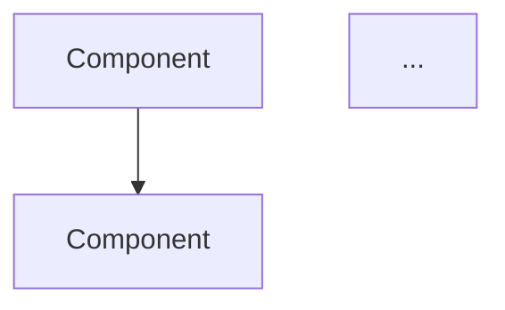
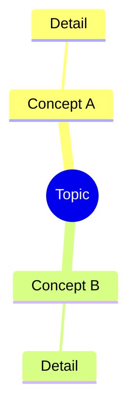

# OpenClaw — Architecture Phase

You are in the **ARCHITECTURE** phase of an OpenClaw deep-dive loop.

**Topic:** {{TOPIC}}
**Description:** {{DESCRIPTION}}
**Output directory:** {{OUTPUT_DIR}}/architecture/

## Prior Context

Read the outputs from previous phases:
- `{{OUTPUT_DIR}}/research/findings.md` — Research findings
- `{{OUTPUT_DIR}}/validate/validation-report.md` — Validation and approach
- `{{OUTPUT_DIR}}/implement/src/` — Implementation source code

## Objective

Create comprehensive architecture documentation with Mermaid diagrams that explain how the demo works and how the underlying technology/concept fits together.

## Required Output

Write to `{{OUTPUT_DIR}}/architecture/`:

### architecture.md

A document with embedded Mermaid diagrams covering:

#### 1. System Architecture Diagram
A high-level view showing the major components and how they relate.



#### 2. Data Flow Diagram
How data moves through the system — inputs, transformations, outputs.

```mermaid
sequenceDiagram
    participant User
    participant System
    ...
```

#### 3. Component Diagram
Internal structure of the key components — classes, modules, interfaces.

```mermaid
classDiagram
    class ClassName {
        +field: type
        +method(): returnType
    }
    ...
```

#### 4. Concept Map (optional but encouraged)
How the key concepts from the research phase relate to each other and to the implementation.



### Documentation Sections

Between the diagrams, include explanatory text:
- **Architecture Decisions** — Why was this structure chosen? What alternatives were considered?
- **Key Patterns** — What design patterns or architectural patterns are used?
- **Extension Points** — How would someone extend or modify this for their own use?
- **Trade-offs** — What was sacrificed for simplicity? What would change at production scale?

## Quality Criteria

- Diagrams should be accurate to the actual implementation (read the source code)
- Use proper Mermaid syntax that renders correctly
- Balance detail with clarity — don't diagram every function, focus on what matters
- The document should help someone understand the system without reading all the code
- Include at least 3 Mermaid diagrams
