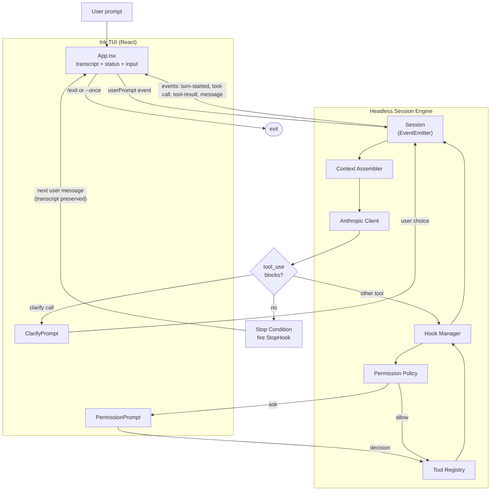

# souschef — original design plan

This file is the as-built design record for `packages/souschef/`. It captures the
plan that was agreed upon before any code was written, kept verbatim alongside
the implementation as a future reference. The implementation may evolve; this
document does not.

---

A new yarn workspace at `packages/souschef/` that ships the `souschef` binary. It mirrors the layered architecture Claude Code is known for, scaled down to the essentials: an agentic harness with hooks, a context+model module, a stop condition, plan/edit modes, a permissions system, an Ink-based interactive React TUI with a clarifying-question affordance, multi-turn conversation persistence, and a small ASCII souschef mascot.

> Note: `packages/` is a new top-level workspace category alongside `shared/`, `apps/`, `prototypes/`. The existing `shared/mcp-cli` package is the closest stylistic precedent (TypeScript, NodeNext ESM, `bin` entry, lazy registry).

## High-level architecture



## Workspace layout

```
packages/
└── souschef/
    ├── package.json          # name: @proto-portal/souschef, bin: souschef
    ├── tsconfig.json         # mirrors shared/mcp-cli, adds jsx: react-jsx
    ├── PLAN.md               # this file
    ├── README.md
    └── src/
        ├── cli.ts            # argv parsing, mode selection, session bootstrap
        ├── session.ts        # owns the agent loop + transcript
        ├── config.ts         # loads .souschef/config.json (hooks, perms, model)
        ├── context/
        │   ├── assemble.ts   # builds system+messages array each turn
        │   └── system-prompt.ts
        ├── model/
        │   ├── anthropic.ts  # POST /v1/messages, tool-use protocol
        │   └── types.ts      # ToolUseBlock, ToolResultBlock, StopReason
        ├── tools/
        │   ├── registry.ts   # ToolDefinition[], filtered per mode
        │   ├── read-file.ts  # read-only
        │   ├── list-dir.ts   # read-only
        │   ├── grep.ts       # read-only
        │   ├── write-file.ts # mutating
        │   ├── edit-file.ts  # mutating (string replace)
        │   ├── run-shell.ts  # mutating
        │   └── clarify.ts    # asks the user a structured question (UI-backed)
        ├── ui/
        │   ├── App.tsx              # root Ink component, subscribes to session events
        │   ├── events.ts            # SessionEvent union
        │   ├── theme.ts             # color tokens (no hex outside this file)
        │   └── components/
        │       ├── TranscriptView.tsx
        │       ├── AssistantMessage.tsx
        │       ├── ToolCallCard.tsx
        │       ├── StatusBar.tsx
        │       ├── InputBox.tsx
        │       ├── PermissionPrompt.tsx
        │       ├── ClarifyPrompt.tsx
        │       └── Mascot.tsx
        ├── hooks/
        │   ├── types.ts
        │   ├── manager.ts
        │   └── builtins/
        │       ├── audit.ts
        │       └── plan-summary.ts
        ├── permissions/
        │   ├── policy.ts
        │   └── prompt.ts
        └── modes/
            ├── plan.ts
            └── edit.ts
```

## Tool-use loop

`src/session.ts` is an `EventEmitter`. The `Session` is **long-lived**: it owns the transcript, runs one agent cycle per user message, and waits on a queue between cycles for the next prompt.

```ts
export class Session extends EventEmitter {
  private transcript: Message[] = [];      // persists across turns
  private runtimePolicy: PolicyOverrides = {};
  private inbox = new AsyncQueue<UserInput>();

  sendUserMessage(text: string) { this.inbox.push({ kind: "message", text }); }
  sendCommand(cmd: SlashCommand)  { this.inbox.push({ kind: "command", cmd }); }
  exit()                          { this.inbox.push({ kind: "exit" }); }

  async start(opts: SessionOptions) {
    this.emit("session-start", { mode: opts.mode, model: opts.model });
    if (opts.userPrompt) this.sendUserMessage(opts.userPrompt);

    while (true) {
      this.emit("awaiting-user-input");
      const input = await this.inbox.pop();
      if (input.kind === "exit") break;
      if (input.kind === "command") { this.handleSlash(input.cmd); continue; }

      this.transcript.push({ role: "user", content: input.text });
      await this.runAgentCycle(opts);
      if (opts.once) break;
    }
    this.emit("session-end");
  }

  private async runAgentCycle(opts: SessionOptions) {
    const tools = registry.forMode(opts.mode);
    for (let turn = 0; turn < opts.maxTurns; turn++) {
      this.emit("turn-started", { turn });
      const { system, messages } = assembleContext(this.transcript, opts);
      const response = await anthropic.messages({ system, messages, tools });
      this.transcript.push({ role: "assistant", content: response.content });
      this.emit("assistant-message", { content: response.content });

      const toolUses = response.content.filter(b => b.type === "tool_use");
      if (toolUses.length === 0 || response.stop_reason === "end_turn") {
        await hooks.run("Stop", { transcript: this.transcript, reason: response.stop_reason });
        this.emit("stop", { reason: "end_turn" });
        return;
      }

      const toolResults: ToolResultBlock[] = [];
      for (const call of toolUses) {
        this.emit("tool-call", { call });

        const veto = await hooks.run("PreToolUse", { call });
        if (veto?.deny) { toolResults.push(errorResult(call, veto.reason)); continue; }

        if (call.name === "clarify") {
          const answer = await this.requestUI("clarify", call.input);
          const result = okResult(call, answer);
          this.emit("tool-result", { call, result }); toolResults.push(result); continue;
        }

        const decision = await permissions.check(call, opts.policy, this.runtimePolicy);
        const final = decision === "ask" ? await this.requestUI("permission", { call }) : decision;
        if (final === "deny") { toolResults.push(errorResult(call, "denied")); continue; }
        if (final === "always-allow") this.runtimePolicy[call.name] = "allow";

        const result = await tools.execute(call);
        await hooks.run("PostToolUse", { call, result });
        this.emit("tool-result", { call, result }); toolResults.push(result);
      }
      this.transcript.push({ role: "user", content: toolResults });
    }
    await hooks.run("Stop", { transcript: this.transcript, reason: "max_turns" });
    this.emit("stop", { reason: "max_turns" });
  }
}
```

`this.transcript` is **never reset between user messages** — every follow-up prompt is appended to the same array, so the model has full back-and-forth context. The Stop hook fires once **per user message** (per agent cycle), not once per process.

## Multi-turn conversation persistence

- **Single transcript array** lives on `Session` for the lifetime of the process.
- **Context truncation** drops the oldest tool-result pairs first when the char budget is exceeded; the current user message and the most recent N assistant turns are always kept.
- **Stop hook fires per cycle** so user hooks can react to each completed answer without ending the conversation.
- **Permission session memory** (`runtimePolicy`) persists across turns.
- **Exit conditions**: `/exit`, `exit`, Ctrl-C, Ctrl-D, `--once`, or SIGTERM.

Slash commands:

| Command | Effect |
|---|---|
| `/exit` | End the session. |
| `/clear` | Wipe the transcript, keep mode + permissions. |
| `/mode plan` / `/mode edit` | Hot-swap modes; tool registry filter updates immediately. |
| `/save <path>` | Write transcript JSON for inspection. |
| `/help` | Show available slash commands. |

## Stop condition

The Stop hook fires when **any** of these is true:
- Model returns `stop_reason: "end_turn"` with no `tool_use` blocks.
- An explicit pseudo-tool `finish` is called by the model.
- `maxTurns` is exceeded.

The Stop hook receives `{ transcript, reason }`, so user-defined hooks can branch.

## Modes

```ts
// modes/plan.ts
export const planMode: ModeConfig = {
  name: "plan",
  systemPromptAddendum:
    "You are in PLAN MODE. Do not modify files. Investigate, then call `finish` " +
    "with a markdown plan. Mutating tools are unavailable.",
  allowedTools: ["read-file", "list-dir", "grep", "clarify", "finish"],
  defaultPolicy: { "*": "allow" },
};

// modes/edit.ts
export const editMode: ModeConfig = {
  name: "edit",
  systemPromptAddendum: "You may modify the workspace using the provided tools.",
  allowedTools: ["read-file","list-dir","grep","write-file","edit-file","run-shell","clarify","finish"],
  defaultPolicy: {
    "read-file": "allow", "list-dir": "allow", "grep": "allow",
    "write-file": "ask", "edit-file": "ask", "run-shell": "ask",
  },
};
```

`registry.forMode(mode)` filters to `mode.allowedTools` so plan mode can't even *describe* the mutating tools to the model — closes the loophole rather than relying on prompts alone.

## Interactive TUI — Ink (React for the terminal)

A scrolling transcript on top, a status bar, an input box at the bottom, and modal overlays for permission/clarify prompts. **No pet/animation system** — just clean transcript blocks, a single spinner during model calls, and modal selects when input is needed.

`SessionEvent` formalizes the wire between engine and renderer:

```ts
export type SessionEvent =
  | { type: "session-start"; mode: ModeName; model: string }
  | { type: "turn-started"; turn: number }
  | { type: "assistant-message"; content: ContentBlock[] }
  | { type: "tool-call"; call: ToolUseBlock }
  | { type: "tool-result"; call: ToolUseBlock; result: ToolResultBlock }
  | { type: "permission-request"; id: string; call: ToolUseBlock }
  | { type: "clarify-request"; id: string; question: string;
      options: { id: string; label: string }[]; allowMultiple: boolean }
  | { type: "stop"; reason: "end_turn" | "max_turns" };
```

### The clarify flow — the "design decisions" hook

A first-class tool the model can call **whenever it would otherwise have to guess**:

```ts
export const clarifyTool: ToolDefinition = {
  name: "clarify",
  description:
    "Ask the user a clarifying design-decision question. Use this BEFORE making " +
    "non-obvious architectural or stylistic choices. Provide 2-5 distinct options.",
  input_schema: {
    type: "object",
    required: ["question", "options"],
    properties: {
      question: { type: "string" },
      options: {
        type: "array", minItems: 2, maxItems: 5,
        items: { type: "object", required: ["id","label"],
          properties: { id: { type: "string" }, label: { type: "string" } } },
      },
      allow_multiple: { type: "boolean", default: false },
      context: { type: "string", description: "1-2 sentences explaining why this matters" },
    },
  },
};
```

The session does **not** dispatch `clarify` to the tool registry — it emits a `clarify-request` event, the Ink `ClarifyPrompt` renders a select list, and the user's pick is fed back as the `tool_result`.

System-prompt nudge in both modes: *"When you encounter a non-trivial design choice (naming, file layout, library selection, behavior trade-offs), prefer calling `clarify` over guessing. Skip clarify only when the answer is obvious from the user's prompt."*

### TUI rendering rules

- Tool calls render as collapsed cards `▸ read-file  src/foo.ts`.
- Tool results show a 1-line summary plus a truncated preview if textual.
- Assistant messages render as wrapped text with a left border accent.
- Status bar shows `mode · model · turn N/M · ⠋ thinking` using `ink-spinner` only while a model call is in flight.
- Theme tokens live in `ui/theme.ts` only.

### ASCII souschef mascot

Banner (rendered once at session start, above the transcript — **4 lines**):

```
    .---.
   /     \    souschef
  | (o_o) |   what shall we cook?
   `-----'
```

Compact glyph (inline left of the StatusBar — **single line**):

```
( o_o )^  souschef · plan · sonnet · turn 2/25 · ⠋

idle:     ( o_o )^
thinking: ( -.- )^
done:     ( ^_^ )^
```

The trailing `^` is a tiny chef-hat tip; the parens are the head; the eyes/mouth are the only thing that changes between states. State transitions are driven by `session.busy` (model call or tool in flight) and a brief flash after `stop` events. No idle animations, random behaviors, or personality state machine.

## Permissions

- Policy shape: `Record<ToolName | \`${ToolName}:${argPattern}\`, "allow" | "ask" | "deny">`.
- Resolution order: exact match with arg pattern → tool-name fallback → `"*"` default → `"ask"`.
- "Always allow" is stored on `Session.runtimePolicy` so subsequent matching calls skip the prompt.
- Denied calls do **not** throw — they synthesize a `tool_result` with `is_error: true`.
- The `ask` decision is delivered through the TUI's `PermissionPrompt` (allow once / always allow / deny once) when running interactively, falling back to readline `y/n/a` otherwise.

Example `.souschef/config.json`:

```json
{
  "model": "claude-sonnet-4-6",
  "maxTurns": 25,
  "permissions": {
    "read-file": "allow",
    "run-shell:rm *": "deny",
    "run-shell:git *": "ask",
    "write-file:**/*.md": "allow"
  },
  "hooks": [
    { "event": "PostToolUse", "module": "./hooks/audit.js" },
    { "event": "Stop", "matcher": { "mode": "plan" }, "module": "./hooks/save-plan.js" }
  ]
}
```

## Hooks

```ts
export type HookEvent = "PreToolUse" | "PostToolUse" | "Stop";

export interface PreToolUsePayload { call: ToolUseBlock; }
export interface PostToolUsePayload { call: ToolUseBlock; result: ToolResultBlock; }
export interface StopPayload { transcript: Message[]; reason: StopReason; }

export type HookFn<E extends HookEvent> =
  (payload: PayloadFor<E>) => Promise<HookResultFor<E> | void>;
```

- PreToolUse may veto: return `{ deny: true, reason }`.
- Post/Stop are observational.
- Hooks loaded lazily via dynamic `import()`.

## Context assembly

`context/assemble.ts` returns `{ system, messages }` each turn:
- `system`: base prompt + mode addendum + cwd + `git status --short` snippet (best-effort) + tool inventory hint.
- `messages`: the running transcript with simple length-based truncation.

## Model invocation

`model/anthropic.ts` POSTs to `https://api.anthropic.com/v1/messages` with `anthropic-version: 2023-06-01`. Reads `ANTHROPIC_API_KEY` from env. Sends `tools: [...]` so Claude can return `tool_use` blocks. Returns `{ content, stop_reason }`.

## CLI surface

```
souschef                           # interactive TUI, edit mode
souschef "<prompt>"                # interactive TUI, edit mode, seeded with prompt
souschef --plan "<prompt>"         # plan mode (read-only)
souschef --edit "<prompt>"         # explicit edit mode
souschef --no-tui "<prompt>"       # headless: plain-text + readline prompts
souschef --no-mascot "<prompt>"    # suppress mascot
souschef --once "<prompt>"         # one-shot: run a single cycle and exit
souschef --max-turns 10 "<prompt>"
souschef --config ./my.json "<prompt>"
souschef --help
```

## What this design intentionally leaves out

- No streaming responses (single-shot per turn keeps the loop legible).
- No subagents / Task tool — single agent only.
- No MCP integration in v1 (could later reuse `shared/mcp-cli`).
- No conversation persistence **between invocations** (in-process only; `/save` is the explicit opt-in).
- No tokenizer-aware compaction (char-budget truncation only).
- **No pet system** — the ASCII souschef is purely decorative branding with face changes tied to existing session state.
- No diff-renderer for `edit-file` results in v1.
